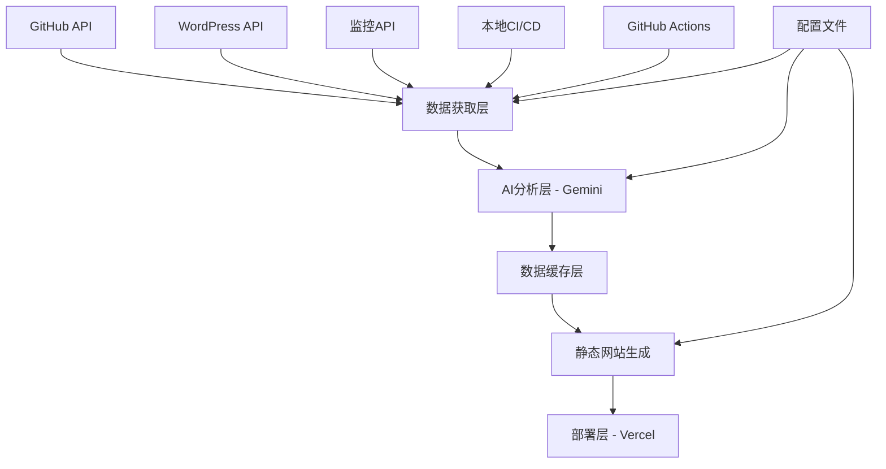

# 设计文档

## 概述

书樱寄语网络工作室官网是一个基于React 18+、TypeScript和Tailwind CSS构建的现代化纯静态网站。系统采用数据驱动的架构，通过自动化脚本从GitHub API、WordPress API等数据源获取内容，使用Google Gemini AI进行智能分析和内容生成，最终输出可部署在Vercel等平台的静态网站。

该系统的核心设计理念是实现完全自动化的内容管理流程，通过AI智能筛选和分析GitHub项目数据，自动生成高质量的项目展示内容，同时支持多语言展示和现代化的用户体验。系统采用纯静态架构确保高性能和低成本部署，通过CI/CD自动化流程实现内容的定期更新和部署。

## 架构

### 整体架构



### 技术栈

- **前端框架**: React 18+ with TypeScript
- **样式框架**: Tailwind CSS
- **构建工具**: Vite (静态导出，优于Next.js静态导出)
- **AI服务**: Google Gemini API
- **数据源**: GitHub API, WordPress REST API, BetterStack API (可选)
- **部署平台**: Vercel
- **CI/CD**: GitHub Actions + 本地脚本
- **多语言**: React i18next
- **SEO**: React Helmet
- **统计分析**: Google Analytics 4
- **性能监控**: Web Vitals
- **图片优化**: WebP/AVIF支持
- **社交分享**: Open Graph, Twitter Cards

## 组件和接口

### 数据获取层 (Data Fetcher)

#### GitHub数据获取器
```typescript
interface GitHubFetcher {
  fetchRepositories(org: string, user: string): Promise<Repository[]>
  fetchOrganizationMembers(org: string): Promise<Member[]>
  fetchContributionStats(username: string): Promise<ContributionStats>
  fetchRepositoryDetails(repo: string): Promise<RepositoryDetails>
}

interface Repository {
  id: string
  name: string
  description: string
  language: string
  topics: string[]
  stars: number
  forks: number
  lastUpdated: Date
  readme: string
  homepage?: string
}
```

#### WordPress博客获取器
```typescript
interface WordPressFetcher {
  fetchPosts(limit?: number): Promise<BlogPost[]>
  fetchPostsByCategory(category: string): Promise<BlogPost[]>
  fetchMultilingualPosts(): Promise<BlogPost[]>
}

interface BlogPost {
  id: string
  title: string
  excerpt: string
  content: string
  publishDate: Date
  author: string
  categories: string[]
  tags: string[]
  featuredImage?: string
  slug: string
  language: 'zh' | 'en'
  originalUrl: string
}
```

#### 状态监控获取器 (可选)
```typescript
interface StatusMonitor {
  fetchServiceStatus(): Promise<ServiceStatus[]>
  fetchUptimeStats(): Promise<UptimeStats>
  fetchBetterStackData(): Promise<BetterStackStatus>
}

interface ServiceStatus {
  name: string
  status: 'operational' | 'degraded' | 'down'
  responseTime: number
  uptime: number
  lastChecked: Date
  description: {
    zh: string
    en: string
  }
}

interface BetterStackStatus {
  services: ServiceStatus[]
  overallStatus: 'operational' | 'issues'
  incidents: Incident[]
}
```

### AI分析层 (AI Analyzer)

#### Gemini分析器
```typescript
interface GeminiAnalyzer {
  analyzeRepository(repo: Repository): Promise<RepositoryAnalysis>
  generateProjectDescription(repo: Repository, language: 'zh' | 'en'): Promise<string>
  categorizeProjects(repos: Repository[]): Promise<ProjectCategory[]>
  evaluateProjectValue(repo: Repository): Promise<ProjectScore>
  generateMultilingualContent(repo: Repository): Promise<MultilingualContent>
  intelligentProjectFiltering(repos: Repository[]): Promise<Repository[]>
}

interface MultilingualContent {
  title: {
    zh: string
    en: string
  }
  description: {
    zh: string
    en: string
  }
  highlights: {
    zh: string[]
    en: string[]
  }
}

interface RepositoryAnalysis {
  score: number // 0-100
  category: ProjectCategory
  techStack: string[]
  highlights: {
    zh: string[]
    en: string[]
  }
  description: {
    zh: string
    en: string
  }
  shouldDisplay: boolean
  reasoning: string
  seoKeywords: {
    zh: string[]
    en: string[]
  }
  socialShareContent: {
    zh: SocialContent
    en: SocialContent
  }
}

interface SocialContent {
  title: string
  description: string
  hashtags: string[]
}

interface ProjectScore {
  completeness: number
  technicalComplexity: number
  documentationQuality: number
  overallScore: number
}
```

### 数据缓存层 (Data Cache)

#### 缓存管理器
```typescript
interface CacheManager {
  saveRepositories(repos: Repository[]): Promise<void>
  saveAnalysis(analysis: RepositoryAnalysis[]): Promise<void>
  saveBlogPosts(posts: BlogPost[]): Promise<void>
  saveMembers(members: Member[]): Promise<void>
  loadCachedData<T>(key: string): Promise<T | null>
  isDataStale(key: string, maxAge: number): boolean
}

// 缓存文件结构
interface CacheStructure {
  'data/repositories.json': Repository[]
  'data/analysis.json': RepositoryAnalysis[]
  'data/blog-posts.json': BlogPost[]
  'data/members.json': Member[]
  'data/contributions.json': ContributionStats
  'data/tech-stack.json': TechStackStats
  'data/service-status.json': ServiceStatus[]
  'data/seo-metadata.json': SEOMetadata
  'data/social-content.json': SocialContent[]
}
```

### 前端组件架构

#### 页面组件
```typescript
// 主要页面组件
interface PageComponents {
  HomePage: React.FC
  ProjectsPage: React.FC
  TechStackPage: React.FC
  TeamPage: React.FC
  BlogPage: React.FC
  ContactPage: React.FC
  ContributionsPage: React.FC
}

// 共享组件
interface SharedComponents {
  Header: React.FC<{language: string}>
  Footer: React.FC
  LanguageSwitcher: React.FC
  ProjectCard: React.FC<{project: DisplayProject}>
  BlogCard: React.FC<{post: BlogPost}>
  MemberCard: React.FC<{member: Member}>
  TechStackChart: React.FC<{data: TechStackStats}>
  ContributionHeatmap: React.FC<{data: ContributionStats}>
  ServiceStatusBadge: React.FC<{status: ServiceStatus}>
  SocialShareButtons: React.FC<{content: SocialContent}>
  SEOHead: React.FC<{metadata: SEOMetadata}>
  CookieConsent: React.FC
  PerformanceMonitor: React.FC
}
```

## 数据模型

### 核心数据模型

#### 项目展示模型
```typescript
interface DisplayProject {
  id: string
  name: string
  title: {
    zh: string
    en: string
  }
  description: {
    zh: string
    en: string
  }
  category: ProjectCategory
  techStack: string[]
  highlights: string[]
  githubUrl: string
  demoUrl?: string
  images: string[]
  stats: {
    stars: number
    forks: number
    commits: number
  }
  lastUpdated: Date
}

enum ProjectCategory {
  WEB_APPLICATION = 'web-app',
  MOBILE_APPLICATION = 'mobile-app',
  OPEN_SOURCE_TOOL = 'open-source',
  LIBRARY_FRAMEWORK = 'library',
  AUTOMATION_SCRIPT = 'automation',
  OTHER = 'other'
}
```

#### 技术栈统计模型
```typescript
interface TechStackStats {
  languages: LanguageStat[]
  frameworks: FrameworkStat[]
  tools: ToolStat[]
  services: ServiceOffering[]
}

interface LanguageStat {
  name: string
  percentage: number
  projectCount: number
  color: string
}

interface ServiceOffering {
  name: {
    zh: string
    en: string
  }
  description: {
    zh: string
    en: string
  }
  techStack: string[]
  category: 'frontend' | 'backend' | 'mobile' | 'devops' | 'consulting'
}
```

#### 团队成员模型
```typescript
interface Member {
  id: string
  name: string
  role: {
    zh: string
    en: string
  }
  avatar: string
  githubUsername: string
  bio: {
    zh: string
    en: string
  }
  skills: string[]
  contributions: {
    commits: number
    pullRequests: number
    issues: number
  }
  socialLinks: {
    github: string
    twitter?: string
    linkedin?: string
    blog?: string
  }
}
```

### 配置模型

#### 主配置文件
```typescript
interface SiteConfig {
  site: {
    name: {
      zh: string
      en: string
    }
    description: {
      zh: string
      en: string
    }
    url: string
    defaultLanguage: 'zh' | 'en'
    supportedLanguages: string[]
    logo?: string
    favicon?: string
  }
  
  github: {
    organization: string
    personalAccount: string
    excludeRepositories: string[]
    includeRepositories?: string[]
    accessToken: string
  }
  
  wordpress: {
    apiUrl: string
    categories?: string[]
    multilingualSupport: boolean
  }
  
  ai: {
    geminiApiKey: string
    analysisPrompts: {
      projectEvaluation: string
      descriptionGeneration: string
      categoryClassification: string
      multilingualGeneration: string
    }
    fallbackStrategy: 'cache' | 'manual' | 'skip'
  }
  
  analytics: {
    googleAnalyticsId?: string
    enableCookieConsent: boolean
    trackingEvents: string[]
  }
  
  social: {
    github: string
    twitter?: string
    linkedin?: string
    weibo?: string
    wechat?: string
    email: string
    shareButtons: ('twitter' | 'linkedin' | 'weibo' | 'wechat')[]
  }
  
  monitoring?: {
    betterStackApiKey?: string
    statusPageUrl?: string
    enableStatusPage: boolean
  }
  
  seo: {
    enableSitemap: boolean
    enableRobotsTxt: boolean
    enableStructuredData: boolean
    defaultKeywords: {
      zh: string[]
      en: string[]
    }
  }
  
  performance: {
    enableWebVitals: boolean
    enableImageOptimization: boolean
    enableCodeSplitting: boolean
    cacheStrategy: 'aggressive' | 'moderate' | 'minimal'
  }
}
```

## 错误处理

### 错误处理策略

#### API调用错误处理
```typescript
interface ErrorHandler {
  handleGitHubApiError(error: GitHubApiError): Promise<void>
  handleGeminiApiError(error: GeminiApiError): Promise<void>
  handleWordPressApiError(error: WordPressApiError): Promise<void>
  handleBuildError(error: BuildError): Promise<void>
}

// 错误恢复策略
enum ErrorRecoveryStrategy {
  USE_CACHE = 'use-cache',
  SKIP_FEATURE = 'skip-feature',
  USE_FALLBACK = 'use-fallback',
  RETRY_WITH_BACKOFF = 'retry-backoff',
  FAIL_BUILD = 'fail-build'
}

interface ErrorConfig {
  github: {
    rateLimitStrategy: ErrorRecoveryStrategy.RETRY_WITH_BACKOFF
    networkErrorStrategy: ErrorRecoveryStrategy.USE_CACHE
    authErrorStrategy: ErrorRecoveryStrategy.FAIL_BUILD
  }
  gemini: {
    quotaExceededStrategy: ErrorRecoveryStrategy.USE_FALLBACK
    networkErrorStrategy: ErrorRecoveryStrategy.USE_CACHE
  }
  wordpress: {
    networkErrorStrategy: ErrorRecoveryStrategy.USE_CACHE
    notFoundStrategy: ErrorRecoveryStrategy.SKIP_FEATURE
  }
}
```

### 日志记录
```typescript
interface Logger {
  info(message: string, context?: object): void
  warn(message: string, context?: object): void
  error(message: string, error: Error, context?: object): void
  debug(message: string, context?: object): void
}

// 日志输出格式
interface LogEntry {
  timestamp: string
  level: 'info' | 'warn' | 'error' | 'debug'
  message: string
  context?: object
  error?: {
    name: string
    message: string
    stack: string
  }
}
```

## 测试策略

### 测试层级

#### 单元测试
- 数据获取器函数测试
- AI分析器逻辑测试
- 缓存管理器测试
- 工具函数测试
- React组件单元测试

#### 集成测试
- API集成测试（使用mock数据）
- 数据流集成测试
- 构建流程测试
- 部署流程测试

#### 端到端测试
- 完整的数据获取到网站生成流程
- 多语言切换功能测试
- 响应式设计测试
- 性能测试

### 测试工具
```typescript
// 测试技术栈
interface TestingStack {
  unitTesting: 'Vitest' | 'Jest'
  componentTesting: '@testing-library/react'
  e2eTesting: 'Playwright' | 'Cypress'
  apiMocking: 'MSW' // Mock Service Worker
  performanceTesting: 'Lighthouse CI'
}

// 测试配置
interface TestConfig {
  coverage: {
    threshold: 80
    include: ['src/**/*.{ts,tsx}']
    exclude: ['src/**/*.test.{ts,tsx}', 'src/**/*.stories.{ts,tsx}']
  }
  e2e: {
    baseUrl: 'http://localhost:3000'
    browsers: ['chromium', 'firefox', 'webkit']
  }
}
```#
# CI/CD流程设计

### 本地开发流程

#### 开发脚本
```bash
# 本地数据更新脚本
npm run data:fetch     # 获取GitHub和WordPress数据
npm run data:analyze   # AI分析和内容生成
npm run data:cache     # 缓存数据到JSON文件
npm run build          # 构建静态网站
npm run preview        # 本地预览

# 开发模式
npm run dev           # 启动开发服务器（使用缓存数据）
npm run dev:fresh     # 启动开发服务器（重新获取数据）
```

#### 本地配置文件结构
```
project/
├── .env.local                 # 本地环境变量
├── config/
│   ├── site.config.ts        # 站点配置
│   ├── github.config.ts      # GitHub配置
│   └── ai.config.ts          # AI配置
├── scripts/
│   ├── fetch-data.ts         # 数据获取脚本
│   ├── analyze-content.ts    # AI分析脚本
│   └── build-site.ts         # 构建脚本
├── data/                     # 缓存数据目录
└── src/                      # 源代码目录
```

### GitHub Actions工作流

#### 主要工作流
```yaml
# .github/workflows/update-and-deploy.yml
name: Update Data and Deploy

on:
  schedule:
    - cron: '0 6 * * *'  # 每天早上6点更新
  push:
    branches: [main]
  workflow_dispatch:      # 手动触发

jobs:
  update-and-deploy:
    runs-on: ubuntu-latest
    steps:
      - name: Checkout
        uses: actions/checkout@v4
        
      - name: Setup Node.js
        uses: actions/setup-node@v4
        with:
          node-version: '18'
          cache: 'npm'
          
      - name: Install dependencies
        run: npm ci
        
      - name: Fetch GitHub data
        env:
          GITHUB_TOKEN: ${{ secrets.GITHUB_TOKEN }}
        run: npm run data:fetch:github
        
      - name: Fetch WordPress data
        env:
          WORDPRESS_API_URL: ${{ secrets.WORDPRESS_API_URL }}
        run: npm run data:fetch:wordpress
        
      - name: Fetch Service Status (Optional)
        env:
          BETTERSTACK_API_KEY: ${{ secrets.BETTERSTACK_API_KEY }}
        run: npm run data:fetch:status
        continue-on-error: true
        
      - name: AI Analysis and Content Generation
        env:
          GEMINI_API_KEY: ${{ secrets.GEMINI_API_KEY }}
        run: npm run data:analyze
        
      - name: Generate Review Report
        run: npm run review:generate
        
      - name: Auto-approve or Wait for Review
        id: review
        run: npm run review:process
        timeout-minutes: 30
        
      - name: Generate SEO and Social Content
        run: npm run seo:generate
        
      - name: Optimize Images
        run: npm run images:optimize
        
      - name: Build site
        run: npm run build
        
      - name: Run Performance Tests
        run: npm run test:performance
        
      - name: Deploy to Vercel
        uses: vercel/action@v1
        with:
          vercel-token: ${{ secrets.VERCEL_TOKEN }}
          vercel-org-id: ${{ secrets.VERCEL_ORG_ID }}
          vercel-project-id: ${{ secrets.VERCEL_PROJECT_ID }}
          
      - name: Update Search Console
        env:
          GOOGLE_SEARCH_CONSOLE_KEY: ${{ secrets.GOOGLE_SEARCH_CONSOLE_KEY }}
        run: npm run seo:submit-sitemap
        continue-on-error: true
        
      - name: Send Notification
        if: always()
        env:
          NOTIFICATION_WEBHOOK: ${{ secrets.NOTIFICATION_WEBHOOK }}
        run: npm run notify:deployment -- --status=${{ job.status }}
```

#### 本地开发和CI/CD脚本
```typescript
interface LocalScripts {
  'data:fetch': 'node scripts/fetch-all-data.js'
  'data:fetch:github': 'node scripts/fetch-github.js'
  'data:fetch:wordpress': 'node scripts/fetch-wordpress.js'
  'data:fetch:status': 'node scripts/fetch-status.js'
  'data:analyze': 'node scripts/ai-analysis.js'
  'review:generate': 'node scripts/generate-review.js'
  'review:process': 'node scripts/process-review.js'
  'seo:generate': 'node scripts/generate-seo.js'
  'images:optimize': 'node scripts/optimize-images.js'
  'dev': 'vite'
  'dev:fresh': 'npm run data:fetch && npm run data:analyze && vite'
  'build': 'npm run seo:generate && vite build'
  'preview': 'vite preview'
  'test:performance': 'lighthouse-ci'
  'seo:submit-sitemap': 'node scripts/submit-sitemap.js'
  'notify:deployment': 'node scripts/send-notification.js'
}
```

### 部署策略

#### Vercel部署配置
```json
// vercel.json
{
  "buildCommand": "npm run build",
  "outputDirectory": "dist",
  "framework": "vite",
  "functions": {},
  "rewrites": [
    {
      "source": "/(.*)",
      "destination": "/index.html"
    }
  ],
  "headers": [
    {
      "source": "/static/(.*)",
      "headers": [
        {
          "key": "Cache-Control",
          "value": "public, max-age=31536000, immutable"
        }
      ]
    },
    {
      "source": "/data/(.*).json",
      "headers": [
        {
          "key": "Cache-Control",
          "value": "public, max-age=3600"
        }
      ]
    }
  ]
}
```

## 性能优化策略

### 前端性能优化

#### 代码分割和懒加载
```typescript
// 路由级别的代码分割
const HomePage = lazy(() => import('./pages/HomePage'))
const ProjectsPage = lazy(() => import('./pages/ProjectsPage'))
const BlogPage = lazy(() => import('./pages/BlogPage'))

// 组件级别的懒加载
const ContributionHeatmap = lazy(() => import('./components/ContributionHeatmap'))
const TechStackChart = lazy(() => import('./components/TechStackChart'))

// 图片懒加载
interface LazyImageProps {
  src: string
  alt: string
  className?: string
  placeholder?: string
}

const LazyImage: React.FC<LazyImageProps> = ({ src, alt, className, placeholder }) => {
  const [isLoaded, setIsLoaded] = useState(false)
  const [isInView, setIsInView] = useState(false)
  
  return (
    <div className={className}>
      {isInView && (
         setIsLoaded(true)}
          className={`transition-opacity ${isLoaded ? 'opacity-100' : 'opacity-0'}`}
        />
      )}
    </div>
  )
}
```

#### 资源优化
```typescript
// 图片优化配置
interface ImageOptimization {
  formats: ['webp', 'avif', 'jpg']
  sizes: [320, 640, 1024, 1920]
  quality: 80
  progressive: true
}

// 字体优化
interface FontOptimization {
  preload: ['Inter-Regular.woff2', 'Inter-Bold.woff2']
  display: 'swap'
  subset: 'latin,latin-ext'
}

// Bundle优化
interface BundleOptimization {
  treeshaking: true
  minification: true
  compression: 'gzip'
  splitting: {
    vendor: true
    async: true
  }
}
```

### 数据缓存策略

#### 多层缓存架构
```typescript
interface CacheStrategy {
  // 浏览器缓存
  browser: {
    staticAssets: '1 year'
    dataFiles: '1 hour'
    htmlFiles: '5 minutes'
  }
  
  // CDN缓存
  cdn: {
    staticAssets: '1 year'
    dataFiles: '1 hour'
    htmlFiles: '5 minutes'
  }
  
  // 应用缓存
  application: {
    githubData: '6 hours'
    blogPosts: '1 hour'
    aiAnalysis: '24 hours'
  }
}

// 缓存失效策略
interface CacheInvalidation {
  triggers: [
    'new-commit',
    'new-blog-post',
    'manual-refresh',
    'scheduled-update'
  ]
  strategy: 'incremental' | 'full-refresh'
}
```

## 多语言实现

### i18n架构设计

#### 语言资源结构
```typescript
// 语言资源文件结构
interface LanguageResources {
  'zh/common.json': CommonTranslations
  'zh/pages.json': PageTranslations
  'zh/components.json': ComponentTranslations
  'zh/seo.json': SEOTranslations
  'en/common.json': CommonTranslations
  'en/pages.json': PageTranslations
  'en/components.json': ComponentTranslations
  'en/seo.json': SEOTranslations
}

interface CommonTranslations {
  navigation: {
    home: string
    projects: string
    techStack: string
    team: string
    blog: string
    contact: string
    contributions: string
    status: string
  }
  actions: {
    viewProject: string
    readMore: string
    contact: string
    share: string
    switchLanguage: string
    acceptCookies: string
    rejectCookies: string
  }
  labels: {
    language: string
    lastUpdated: string
    techStack: string
    category: string
    status: string
    uptime: string
    responseTime: string
  }
}

interface SEOTranslations {
  defaultTitle: string
  defaultDescription: string
  keywords: string[]
  socialShareText: string
}
```

#### 动态内容多语言处理
```typescript
// AI生成的多语言内容
interface MultilingualContentGenerator {
  generateDescription(repo: Repository): Promise<{
    zh: string
    en: string
  }>
  
  translateTechStack(techStack: string[]): Promise<{
    zh: string[]
    en: string[]
  }>
  
  categorizeProject(repo: Repository): Promise<{
    zh: ProjectCategory
    en: ProjectCategory
  }>
  
  generateSEOContent(content: any): Promise<{
    zh: SEOContent
    en: SEOContent
  }>
  
  generateSocialContent(project: DisplayProject): Promise<{
    zh: SocialContent
    en: SocialContent
  }>
}

// 语言检测和切换
interface LanguageManager {
  detectUserLanguage(): 'zh' | 'en'
  switchLanguage(lang: 'zh' | 'en'): void
  getCurrentLanguage(): 'zh' | 'en'
  getSupportedLanguages(): string[]
  getLanguageFromPath(path: string): 'zh' | 'en' | null
  generateLanguageRoutes(): LanguageRoute[]
}

interface LanguageRoute {
  path: string
  language: 'zh' | 'en'
  alternates: {
    [lang: string]: string
  }
}
```

## SEO优化实现

### 元数据管理

#### 动态SEO元数据
```typescript
interface SEOMetadata {
  generatePageMeta(page: string, language: string): PageMeta
  generateProjectMeta(project: DisplayProject, language: string): PageMeta
  generateBlogMeta(post: BlogPost, language: string): PageMeta
  generateSocialShareMeta(content: any, language: string): SocialShareMeta
}

interface PageMeta {
  title: string
  description: string
  keywords: string[]
  ogTitle: string
  ogDescription: string
  ogImage: string
  ogUrl: string
  ogType: 'website' | 'article' | 'profile'
  twitterCard: 'summary' | 'summary_large_image'
  twitterSite?: string
  canonicalUrl: string
  alternateUrls: {
    [lang: string]: string
  }
  structuredData: StructuredData
}

interface SocialShareMeta {
  title: string
  description: string
  image: string
  url: string
  hashtags: string[]
}

// 结构化数据
interface StructuredData {
  '@context': 'https://schema.org'
  '@type': 'Organization' | 'WebSite' | 'SoftwareApplication' | 'BlogPosting'
  name?: string
  url?: string
  logo?: string
  sameAs?: string[]
  contactPoint?: ContactPoint
  founder?: Person[]
  description?: string
}

interface ContactPoint {
  '@type': 'ContactPoint'
  contactType: string
  email?: string
  url?: string
}
```

#### Sitemap和SEO文件生成
```typescript
interface SitemapGenerator {
  generateSitemap(): Promise<string>
  generateRobotsTxt(): Promise<string>
  generateLanguageSitemaps(): Promise<{
    [lang: string]: string
  }>
  generateSearchConsoleVerification(): Promise<{
    google?: string
    baidu?: string
    bing?: string
  }>
}

interface SitemapEntry {
  url: string
  lastmod: string
  changefreq: 'daily' | 'weekly' | 'monthly'
  priority: number
  alternates: {
    [lang: string]: string
  }
  images?: ImageSitemapEntry[]
}

interface ImageSitemapEntry {
  url: string
  caption?: string
  title?: string
}
```

## 社交分享和用户交互

### 社交媒体集成

#### 分享功能设计
```typescript
interface SocialShareManager {
  generateShareContent(item: DisplayProject | BlogPost): SocialShareContent
  shareToWeChat(content: SocialShareContent): void
  shareToWeibo(content: SocialShareContent): void
  shareToTwitter(content: SocialShareContent): void
  shareToLinkedIn(content: SocialShareContent): void
  copyShareLink(url: string): void
}

interface SocialShareContent {
  title: string
  description: string
  url: string
  image: string
  hashtags: string[]
  via?: string
}

// 社交媒体元数据
interface SocialMetadata {
  openGraph: {
    title: string
    description: string
    image: string
    url: string
    type: 'website' | 'article'
    siteName: string
    locale: string
  }
  twitter: {
    card: 'summary' | 'summary_large_image'
    title: string
    description: string
    image: string
    site?: string
    creator?: string
  }
  weibo: {
    title: string
    description: string
    image: string
  }
}
```

## 监控和分析

### 性能监控

#### Web Vitals监控
```typescript
interface PerformanceMonitor {
  trackWebVitals(): void
  trackCustomMetrics(name: string, value: number): void
  trackUserInteractions(): void
  trackResourceLoading(): void
  generatePerformanceReport(): PerformanceReport
  optimizeImageLoading(): void
}

interface PerformanceReport {
  coreWebVitals: {
    lcp: number  // Largest Contentful Paint
    fid: number  // First Input Delay
    cls: number  // Cumulative Layout Shift
    fcp: number  // First Contentful Paint
    ttfb: number // Time to First Byte
  }
  customMetrics: {
    dataLoadTime: number
    aiAnalysisTime: number
    buildTime: number
    imageLoadTime: number
    bundleSize: number
  }
  recommendations: string[]
  performanceScore: number
}

// 图片优化
interface ImageOptimizer {
  generateResponsiveImages(src: string): ResponsiveImageSet
  convertToWebP(src: string): string
  convertToAVIF(src: string): string
  generatePlaceholder(src: string): string
  lazyLoadImages(): void
}

interface ResponsiveImageSet {
  webp: {
    '320w': string
    '640w': string
    '1024w': string
    '1920w': string
  }
  avif: {
    '320w': string
    '640w': string
    '1024w': string
    '1920w': string
  }
  fallback: string
}
```

### 用户行为分析

#### Google Analytics 4集成
```typescript
interface AnalyticsTracker {
  trackPageView(page: string, language: string): void
  trackEvent(eventName: string, parameters: AnalyticsEvent): void
  trackProjectView(projectId: string, category: string): void
  trackLanguageSwitch(from: string, to: string): void
  trackContactInteraction(type: string): void
  trackSocialShare(platform: string, content: string): void
  trackPerformanceMetrics(metrics: PerformanceReport): void
  trackSearchQuery(query: string, results: number): void
}

interface AnalyticsEvent {
  event_category: string
  event_label?: string
  value?: number
  custom_parameters?: {
    [key: string]: string | number
  }
}

// 隐私保护
interface PrivacyManager {
  showCookieConsent(): void
  handleConsentChoice(accepted: boolean): void
  anonymizeUserData(): void
  respectDoNotTrack(): boolean
  getCookiePreferences(): CookiePreferences
  updateCookiePreferences(prefs: CookiePreferences): void
}

interface CookiePreferences {
  necessary: boolean
  analytics: boolean
  marketing: boolean
  preferences: boolean
}
```

## 内容审核和管理

### AI内容审核系统

#### 审核工作流设计
```typescript
interface ContentReviewSystem {
  generateReviewReport(analysis: RepositoryAnalysis[]): ReviewReport
  createReviewInterface(): ReviewInterface
  processReviewDecisions(decisions: ReviewDecision[]): ProcessedContent
  saveReviewHistory(review: ReviewRecord): void
  getReviewHistory(): ReviewRecord[]
}

interface ReviewReport {
  suggestedProjects: ProjectSuggestion[]
  aiConfidenceScores: {
    [projectId: string]: number
  }
  contentQualityMetrics: QualityMetrics
  recommendedActions: ReviewAction[]
  generatedAt: Date
}

interface ProjectSuggestion {
  project: DisplayProject
  aiReasoning: string
  confidenceScore: number
  suggestedCategory: ProjectCategory
  potentialIssues: string[]
  recommendedAction: 'include' | 'exclude' | 'review'
}

interface ReviewDecision {
  projectId: string
  action: 'approve' | 'reject' | 'modify'
  modifications?: {
    title?: MultilingualContent['title']
    description?: MultilingualContent['description']
    category?: ProjectCategory
    highlights?: MultilingualContent['highlights']
  }
  reviewerNotes?: string
}

interface ReviewInterface {
  displaySuggestedProjects(): void
  allowContentModification(): void
  provideApprovalControls(): void
  showAIReasoning(): void
  enableBatchOperations(): void
}

// 审核历史记录
interface ReviewRecord {
  id: string
  timestamp: Date
  reviewer: string
  projectsReviewed: number
  decisionsCount: {
    approved: number
    rejected: number
    modified: number
  }
  aiAccuracyScore: number
  notes: string
}
```

### 配置管理和回退策略

#### 内容管理策略
```typescript
interface ContentManagementStrategy {
  handleAIFailure(): FallbackContent
  manageIncrementalUpdates(): UpdateStrategy
  validateContentQuality(): ValidationResult
  implementApprovalWorkflow(): ApprovalWorkflow
}

interface FallbackContent {
  useCache: boolean
  useManualContent: boolean
  skipAIGeneration: boolean
  defaultContent: {
    [projectId: string]: ManualContent
  }
}

interface ManualContent {
  title: MultilingualContent['title']
  description: MultilingualContent['description']
  category: ProjectCategory
  shouldDisplay: boolean
  lastUpdated: Date
}

interface ApprovalWorkflow {
  requiresApproval: boolean
  approvalTimeout: number // minutes
  defaultAction: 'approve' | 'reject' | 'use-cache'
  notificationChannels: string[]
}
```

## 安全考虑

### API安全

#### 密钥管理
```typescript
interface SecurityConfig {
  apiKeys: {
    github: string      // GitHub Personal Access Token
    gemini: string      // Google Gemini API Key
    wordpress?: string  // WordPress API Key (if needed)
    analytics?: string  // Google Analytics ID
  }
  
  rateLimiting: {
    github: {
      requestsPerHour: 5000
      retryAfter: number
    }
    gemini: {
      requestsPerMinute: 60
      quotaLimit: number
    }
  }
  
  cors: {
    allowedOrigins: string[]
    allowedMethods: string[]
  }
}
```

#### 数据验证
```typescript
interface DataValidator {
  validateGitHubResponse(data: unknown): Repository[]
  validateWordPressResponse(data: unknown): BlogPost[]
  validateGeminiResponse(data: unknown): RepositoryAnalysis
  sanitizeUserInput(input: string): string
}

// 输入验证schema
interface ValidationSchema {
  repository: z.ZodSchema<Repository>
  blogPost: z.ZodSchema<BlogPost>
  member: z.ZodSchema<Member>
  config: z.ZodSchema<SiteConfig>
}
```

## 设计决策和理由

### 核心架构决策

#### 1. 纯静态网站架构 + Vite构建
**决策**: 采用纯静态网站 + Vite构建，而非Next.js SSG
**理由**: 
- **成本效益**: 降低托管成本和复杂性，可部署到任何静态托管平台
- **性能优势**: 提供最佳的性能和SEO效果，无服务器延迟
- **简化部署**: Vite的静态构建比Next.js静态导出更简单直接
- **安全性**: 纯静态文件，无服务器攻击面
- **构建速度**: Vite的开发和构建速度显著优于Next.js
- **灵活性**: 不受Next.js约定限制，可自由组织项目结构

#### 2. AI驱动的内容管理
**决策**: 使用Google Gemini AI进行项目分析和内容生成
**理由**:
- 实现完全自动化的内容管理流程
- 提供智能的项目筛选和质量评估
- 支持多语言内容自动生成
- 减少手动维护工作量

#### 3. 多层缓存策略
**决策**: 实现本地JSON缓存、CDN缓存和浏览器缓存
**理由**:
- 提高网站加载性能
- 减少API调用频率和成本
- 提供离线访问能力
- 支持增量更新机制

#### 4. 组件化和模块化设计
**决策**: 采用高度模块化的组件架构
**理由**:
- 提高代码复用性和可维护性
- 支持独立的功能开发和测试
- 便于功能扩展和定制
- 降低系统复杂性

#### 5. 多语言优先设计
**决策**: 从架构层面支持多语言，而非后期添加
**理由**:
- 满足国际化业务需求
- 提供更好的用户体验
- 支持AI生成的多语言内容
- 提升SEO效果和搜索覆盖

#### 6. 渐进式功能实现
**决策**: 将高级功能（如状态监控）设计为可选模块
**理由**:
- 支持分阶段实施和部署
- 降低初期开发复杂性
- 提供灵活的功能配置
- 便于后期功能扩展

### 技术选型对比和理由

#### Vite vs Next.js 详细对比

| 方面 | Vite | Next.js | 我们的选择 |
|------|------|---------|------------|
| **开发速度** | 极快的HMR和冷启动 | 较慢的开发服务器 | ✅ Vite |
| **构建速度** | 快速的生产构建 | 较慢的构建过程 | ✅ Vite |
| **静态导出** | 原生支持，配置简单 | 需要额外配置，可能有限制 | ✅ Vite |
| **Bundle大小** | 更小的输出文件 | 较大的bundle | ✅ Vite |
| **学习曲线** | 简单直观 | 复杂的约定和配置 | ✅ Vite |
| **SEO支持** | 通过预构建实现 | 内置SSG支持 | ⚖️ 平手 |
| **生态系统** | 快速增长 | 成熟完整 | ⚖️ 平手 |
| **部署灵活性** | 任何静态托管 | 主要优化Vercel | ✅ Vite |
| **项目复杂度** | 适合我们的需求 | 功能过多，过度工程 | ✅ Vite |

**最终决策**: 选择Vite，因为它完美匹配我们的纯静态网站需求，提供更好的开发体验和更简单的部署流程。

### 技术选型理由

#### React + TypeScript + Vite (vs Next.js)
**决策**: 选择Vite而非Next.js作为构建工具
**理由**:

**选择Vite的优势**:
- **更快的开发体验**: Vite的热重载和构建速度显著快于Next.js
- **更简单的静态导出**: Vite的静态构建更直接，无需复杂的配置
- **更小的bundle**: 对于纯静态网站，Vite生成的文件更小
- **更灵活的配置**: 不受Next.js的约定限制，可以自由组织项目结构
- **更适合数据预处理**: 我们的数据通过脚本预处理，不需要Next.js的SSR/SSG能力

**Next.js的劣势（在我们的场景下）**:
- **过度工程**: Next.js的SSR、API Routes等功能对纯静态网站是多余的
- **构建复杂性**: 静态导出需要额外配置，且可能遇到兼容性问题
- **学习曲线**: Next.js的约定和配置比Vite复杂
- **部署限制**: 虽然支持静态导出，但主要为Vercel的动态功能优化

**技术栈选择**:
- **React 18+**: 现代化的组件架构和性能优化
- **TypeScript**: 提供类型安全和更好的开发体验  
- **Vite**: 快速的开发构建和优秀的静态输出，完美匹配我们的纯静态需求

#### Tailwind CSS
- 提供一致的设计系统
- 支持响应式设计
- 减少CSS文件大小
- 提高开发效率

#### Google Gemini AI
- 强大的多语言处理能力
- 优秀的代码和项目分析能力
- 合理的API定价
- 良好的开发者生态

这个设计文档提供了完整的技术架构、数据模型、组件设计和实现策略，为后续的开发任务提供了详细的指导。设计充分考虑了所有需求，并提供了灵活的扩展能力和优秀的用户体验。